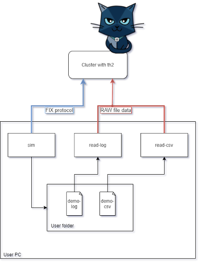

## Overview
This version of sim used for the demo [ver-1.5.3-main_scenario](https://github.com/th2-net/th2-infra-schema-demo/tree/ver-1.5.3-main_scenario).

ℹ️This simulator emulates a test system and is used only to demonstrate the capabilities of th2. 
The simulator is able to respond to NewOrderSingle(FIX) messages and simulate a trade based on a specific scenario. 
Generation of sample files is also implemented in the simulator for demonstration purposes. 

⚠️Please do not use th2 components to save files - this is a harmful approach. 
All information that should be saved - should be saved into the database.

## Links
**Schema example:** https://github.com/th2-net/th2-infra-schema-demo/tree/ver-1.5.3-main_scenario

**Sim configuration:** https://github.com/th2-net/th2-infra-schema-demo/blob/ver-1.5.3-main_scenario/boxes/sim-demo.yml

**Instructions to launch application as External Box:** https://github.com/th2-net/th2-documentation/wiki/Connecting-external-box-to-cluster-using-kubectl

**Test script:** https://github.com/th2-net/th2-demo-script/tree/ver-1.5.3-main_scenario

### Directory for sample files
This sim run locally outside the cluster.
Default file output path is folder *demo_outputs* in user home folder.
To change outputs folder please change filepath [here](https://github.com/th2-net/th2-sim-template/blob/e59c852b44aaaee1da16097d842d847675318b4e/src/main/kotlin/com/exactpro/th2/sim/template/rule/KotlinFIXRule.kt#L37) and [here](https://github.com/th2-net/th2-sim-template/blob/e59c852b44aaaee1da16097d842d847675318b4e/src/main/resources/log4j.properties#L18).

### Scheme of interaction of components outside the th2 cluster

